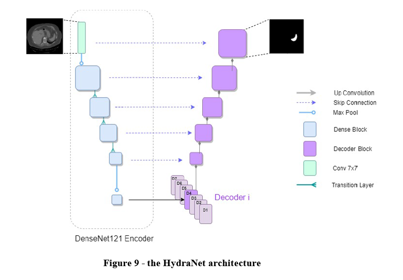

<p align="center">

  <h1 align="center">HydraNet</h1>

  <p align="center">
    HydraNet is a medical segmentation neural network, that can be used as the 
    base for transfer learning to other medical target datasets.
    The network is based on the UNET architecture and was trained on 7 
    different organs with 1 shared encoder and 7 decoders.
    The final weights are available for download, as well as the code for transfer. 
    <br />
    Authors: Ayelet Talby,  Shiri Almog
   
  </p>


<!-- TABLE OF CONTENTS -->
## Table of Contents

* [About](#ABOUT)
* [Datasets](#Datasets)
* [Training](#Training)
* [Transfer](#Transfer)
* [Installation](#Installation)
* [Contact](#Contact)

<!-- ABOUT  -->
## ABOUT
HydraNet is a Unet based neural network, with one encoder and seven different decoders.
We trained HydraNet on 7 different medical target tasks, of both CT and MRI. The goal was 
to create an encoder that can be used for transfer learning in the medical field, 
for cases when data is scarce.
<br>



<p>
The medical imaging field suffers from very limited labelled data which makes using 
deep learning for segmentation challenging. In this project we wanted to investigate the 
improvements transfer learning can offer to the research currently being done on 
deep learning in the medical imaging field. Our goal was to create a pre-trained 
network, trained on a diverse multi-organ medical database (MRI and CT) that can 
be used as a base for transfer learning, and to explore the improvement that it 
offers compared to training from scratch or pre-training from ImageNet. 
Our method focuses on creating a deep encoder by using a Fully Convolutional 
Network architecture with one shared encoder and 7 task-related decoders 
(one for each task in our dataset), named HydraNet. Transfer learning from 
the HydraNet encoder to our target data yielded a dice score of 0.7638 while 
training from scratch yielded a dice score of 0.6687, an improvement of 14.22% 
and a difference that has a great medical significance. </p>

## Datasets
We used 7 datasets in the training of the network :
1. 	<a href=https://competitions.codalab.org/competitions/17094> LiTS- Liver Tumour Segmentation Challenge</a>: Contains 131 CT scans of liver tumours.
2.	<a href=https://www.med.upenn.edu/cbica/brats2020> BraTS- Brain Tumour Segmentation Challenge</a>: Contains 285 multimodal MRI scans, including T1, T1 weighted, T2 and FLARE. 
3.	<a href=https://www.cardiacatlas.org/challenges/left-atrium-segmentation-challenge/>Left Atrial Segmentation Challenge</a>: 10 MRI scans of the left atrium
4.	<a href=http://medicaldecathlon.com/>Medical Segmentation Decathlon</a>: Datasets of the Spleen (41 CT scans), Prostate (32 MRI scans), Pancreas (281 CT scans) , and Hepatic Vessel (303 CT scans)         

Training – 77%, validation – 13%, test – 10%


<!-- GETTING STARTED -->
## Getting Started

To get a local copy up and running follow these simple steps.


### Installation
 
1. Clone the repo
```sh
git clone https://github.com/Shirialmog/HydraNet
```
2. Install PyTorch
```sh
visit https://pytorch.org/
```
3. Install <a href=https://github.com/qubvel/segmentation_models.pytorch>segmentation-models-pytorch</a>
```sh
$ pip install segmentation-models-pytorch
```

### Training
#### HydraNet_Main.py
<p> This is the main script for training the network. It includes the pre-processing functions,
the training loop and the loss calculation functions</p>

#### CreateJson.py and SegmentationSettings.py 
These scripts were used to create json files containing all the relevant information 
for the current experiment. Adjust your settings in the CreateJson script, and then run it
to produce the desired json file.
In the HydraNet_Main, insert your new json path. 

#### Models.py
The architecture of the network 

### Transfer
#### Transfer.py
Use this script to perform transfer learning from the HydraNet. 
This script loads <b>HydraNet_final_weights.pt </b>, the final weights of the HydraNet model (<a href=https://github.com/Shirialmog/HydraNet/blob/master/HydraNet_final_weights.pt>Download here</a>).

Again, accessory scripts CreateJsonTransfer.py and SettingsTransfer.py are used to
create the required json files for the experiment. 


 
<!-- CONTACT -->
## Contact

For more information or questions regarding the code, send us an email at: 

Ayelet Talby - ayelettalby@gmail.com

Shiri Almog - shirialmog1@gmail.com


